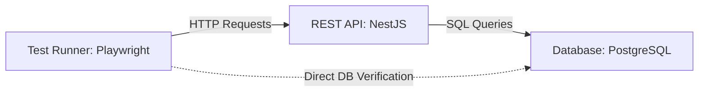

# 🚚 Mini-Dispatch System: Automated Quality Assurance

A robust automated testing framework for a logistics API simulation. This project demonstrates a **Hybrid Testing Strategy** ensuring data integrity across both the API layer and Database state.

## 🛠 Tech Stack

* **Language:** TypeScript
* **Backend:** NestJS (REST API)
* **Database:** PostgreSQL (Dockerized)
* **ORM:** Prisma
* **Testing:** Playwright (API + DB verification)
* **Containerization:** Docker & Docker Compose

## 🚀 Key Features

* **Hybrid Testing:** Tests validate HTTP responses AND verify direct database state changes (Grey-box testing).
* **Database Isolation:** Automatic DB cleaning before each test suite execution.
* **Business Logic Validation:** Ensures couriers cannot be assigned to orders if they are already busy.
* **Dockerized Environment:** One command setup for the entire infrastructure.

## 🏗 Architecture



## 🏃‍♂️ How to Run

1. **Clone the repository:**
   ```bash
   git clone https://github.com/razman0v/mini-dispatch-system.git
   cd mini-dispatch-system

## Install dependencies:

```bash
$ npm install
```

## Start Infrastructure (DB):

```bash
docker compose up -d
```

## Run Migrations:

```bash
npx prisma migrate dev --name init
```

## Run tests

```bash
# Start backend in one terminal
npm run start:dev

# Run tests in another terminal
npx playwright test
```

## Test Example

```typescript
test('should assign courier and update DB', async ({ request }) => {
  // 1. API Action
  await request.post('/orders/1/assign', { data: { courierId: 5 } });
  
  // 2. Database Verification
  const order = await prisma.order.findUnique({ where: { id: 1 } });
  expect(order.status).toBe('delivery'); 
});
```
